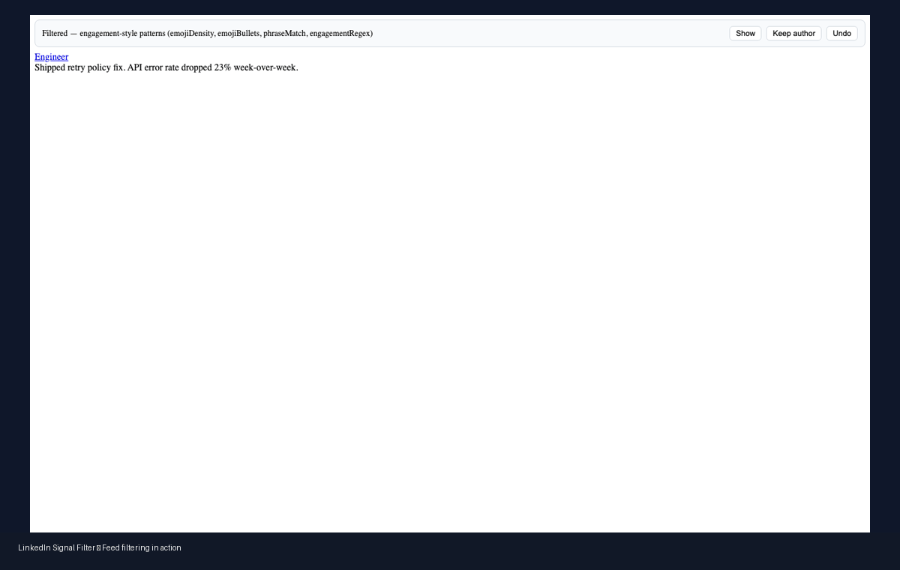
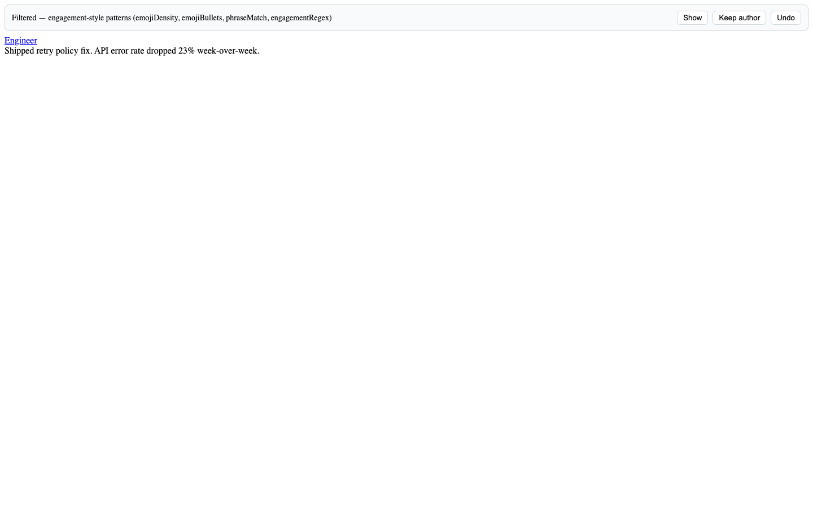
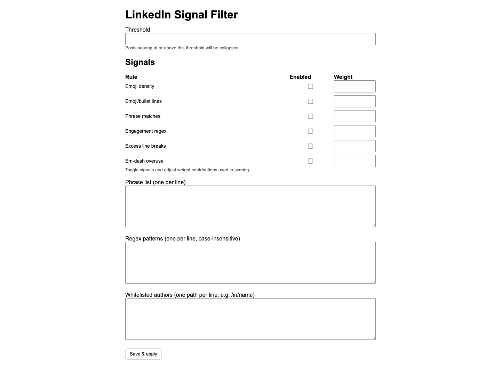

# Slopblock

See more signal, less noise on LinkedIn. Slopblock is a Chrome extension that automatically collapses engagement-bait posts in your LinkedIn feed using local, deterministic rules — no AI, no servers, no tracking.



---

## What it does

Slopblock scores every post in your LinkedIn home feed against a set of configurable signals (emoji density, short-line stacking, CTA endings, hashtag overuse, etc.). Posts that exceed your chosen threshold are silently collapsed with a small banner. You stay in control — you can always reveal a post with a single click.

**In-feed controls on every collapsed post:**
- **Why?** — shows which signals triggered the collapse
- **Show** — reveals the post for this session

**Popup controls:**
- Toggle filtering on/off
- Adjust strictness level (Very strict → Very relaxed)

**Options page** (`...` → Extension options):
- Set an exact threshold score
- Enable/disable individual signals and tune their weights
- Edit custom phrase and regex pattern lists
- Whitelist specific authors by profile path

---

## Screenshots

| Feed | Popup | Options |
|------|-------|---------|
|  |  |  |

---

## Installation

> **Requirements:** Google Chrome (or any Chromium browser) and [Node.js](https://nodejs.org) (v18+).

### Option A — Download ZIP (no Git required)

1. Click **Code → Download ZIP** on this page and extract the archive.
2. Open a terminal in the extracted folder and run:
   ```bash
   npm install
   npm run build
   ```
3. Open Chrome and go to `chrome://extensions/`.
4. Enable **Developer mode** (toggle in the top-right corner).
5. Click **Load unpacked** and select the `dist` folder inside the extracted project.
6. Navigate to `https://www.linkedin.com/feed/` — Slopblock activates automatically.

### Option B — Clone the repository

```bash
git clone https://github.com/PulastTiwari/palt-slopblock.git
cd palt-slopblock
npm install
npm run build
```

Then follow steps 3–6 above.

### Updating

After pulling new changes or extracting a new ZIP:

```bash
npm run build
```

Then click the **↺ refresh** icon on the Slopblock card in `chrome://extensions/`.

---

## How it works

All processing happens locally in your browser. No post text ever leaves your device.

Each post is scored by a set of configurable signals:

| Signal | Default weight | Description |
|--------|---------------|-------------|
| Emoji density | +2 | High emoji-to-word ratio |
| Emoji/bullet lines | +2 | Lines prefixed by emoji or bullets |
| Inline phrase matches | +2 | Matches from your phrase list |
| CTA ending | +3 | Post ends with a call-to-action |
| Excess line breaks | +2 | Many line breaks in a short post |
| Em-dash overuse | +1 | Em-dashes present |
| Hashtag overuse | +2 | High hashtag density |
| Short-line stacking | +3 | 4+ consecutive short lines |
| Technical tokens | −3 | Code keywords detected (reduces false positives) |
| Long paragraph | −2 | Post has a long, dense paragraph |
| No-CTA / no-stack | −2 | Short post with no CTA and no stacking |

Default threshold: **10**. Adjust it from the popup or options page.

---

## Privacy

All filtering is done locally. No data leaves your browser. See [PRIVACY.md](PRIVACY.md) for details.

---

## Development

```bash
npm run dev          # watch build
npm run typecheck    # TypeScript checks
npm test             # unit tests (Jest)
npm run test:e2e     # Playwright E2E tests
npm run ci           # full local CI (typecheck + lint + test + build)
npm run package:zip  # build and package → release/slopblock-extension.zip
```

Releasing a new version — push a version tag and GitHub Actions builds and attaches the ZIP automatically:

```bash
git tag v0.2.0
git push origin v0.2.0
```

---

## License

MIT — see [LICENSE](LICENSE).
